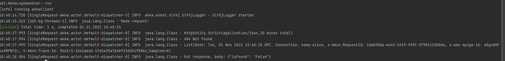
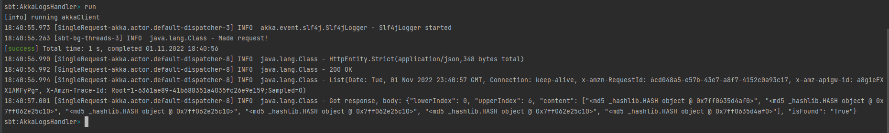

# LocateRecordsInLogs-AkkaHTTP
A distributed program for locating requested records in the log files using Akka-HTTP.
---
Name: Nikita Mashchenko
---

### Development Environment
+ Windows 10
+ GO version 1.19.2
+ IntelliJ IDEA Ultimate

## Entire Setup of the Project:

### Steps to Run the AkkaLogsHandler
- Clone the github repo on your local machine.
- Open the command line at the root of the project.
- Enter your desired configs in application.conf.
- Enter `sbt clean compile test` and see if all the test executions pass.
- Setup the desired Time and Delta time values inside the application.conf.

## Overview
This project covers the Akka HTTP Client called made to the AWS API Gateway which triggers the Lambda Function. 
The Lambda function checks in a binary search algorithm whether the logs in the given time range are present or not. 

If the logs are present, the response returned is the md5 hash of logs with a statusCode of 200. 
If no logs were present in the timerange, the response is a 400-level message with a message that logs were not present in the time range.

## Output
When logs are not present:

 
When logs are present:

## All repos:

https://github.com/exortme1ster/AkkaLogsHandler
https://github.com/exortme1ster/GRPCClientServer
https://github.com/exortme1ster/LogFileGenerator
https://github.com/exortme1ster/pythonLambda

## Video:

